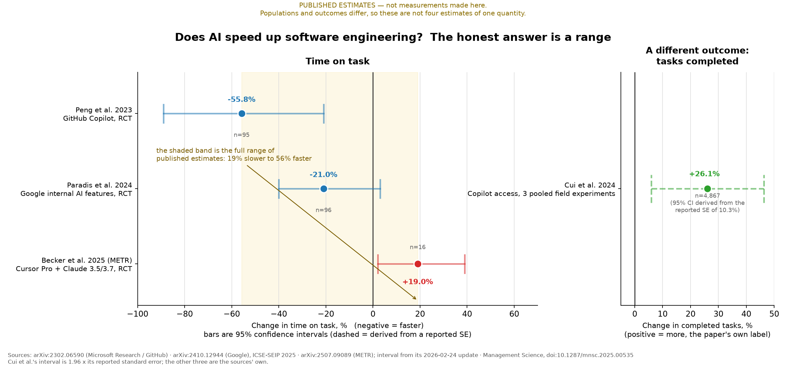
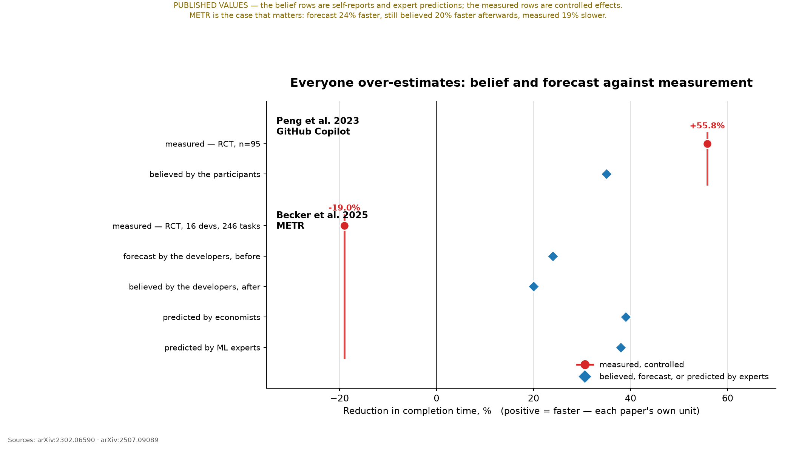
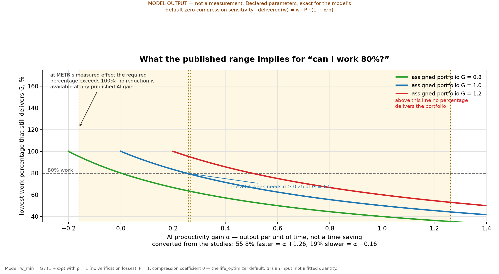
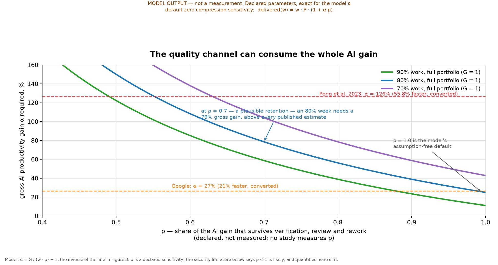
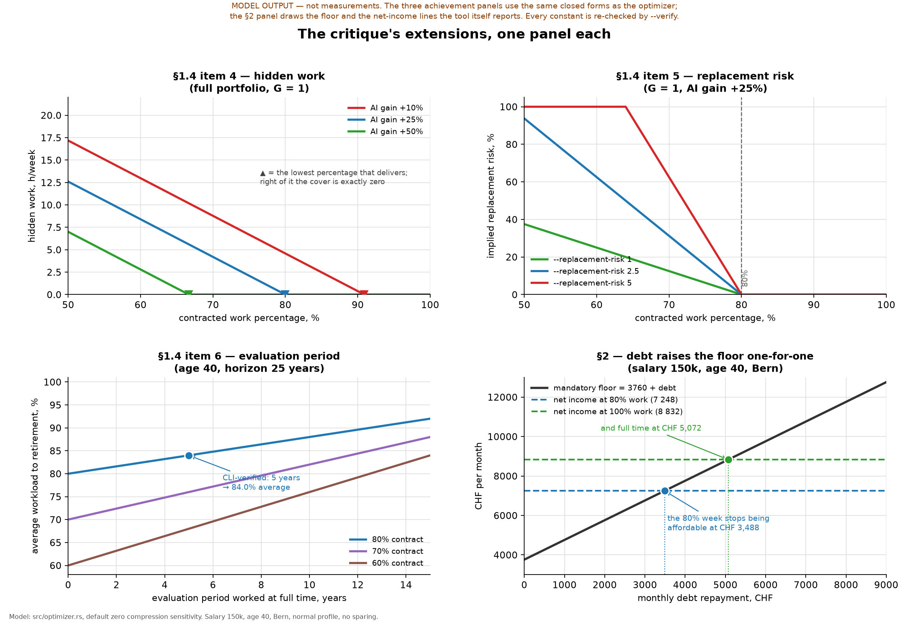

# AI as a Catalyst in Software Engineering

Plots and a reading of the evidence on AI-assisted software work, and what it implies
for Agile and Scrum, for validating delivered quality, and for agentic assurance and
cyber defence.

**Read this first, because it decides how to read every figure.** This repository
contains **no measurements** of AI productivity in software engineering. Everything in
`life_optimizer` is a *declared sensitivity*; the tax tables are sourced, but nothing
here has ever been in the field. So there are two kinds of figure below, and they are
not the same kind of object:

| | Figures 1–2 | Figures 3–5 |
| --- | --- | --- |
| What they show | **Published estimates**, each cited | **Model output** over declared parameters |
| Source | Four field experiments and RCTs | `w_min = G / (1 + αρ)`, the default case of `src/optimizer.rs` |
| Status | Measurements, by other people, on other populations | Not measurements. Arithmetic on inputs you choose |
| Reproduce | Not from here — read the papers | `python tools/plot_ai_catalyst.py` |

Every figure carries its kind in a banner on its own face, so a screenshot cannot
travel without it. The script that draws them
(`tools/plot_ai_catalyst.py`) reproduces the model's closed forms rather than calling
the binary, and `--verify` checks them against the real CLI — three `(goal, gain)`
pairs for the recommended percentage, and four reported quantities for Figure 5 —
so the two cannot drift apart silently.

---

## 1. What is actually measured



Four estimates, and the single most important fact about them is that they disagree
with each other by **75 percentage points**, from 19% slower to 56% faster. They are
not four attempts to measure one quantity that happen to be noisy. They measure
different things:

| Study | Design | Population | Outcome | Effect |
| --- | --- | --- | --- | --- |
| [Peng et al. 2023](https://arxiv.org/abs/2302.06590) | RCT | 95 freelancers, mostly early-career, recruited on Upwork | Time to write one HTTP server, 12 hidden tests | **55.8% faster** (95% CI 21–89%) |
| [Paradis et al. 2024](https://arxiv.org/abs/2410.12944) | RCT | 96 Google engineers, C++, 1+ year tenure | Time on an enterprise-grade task in a monorepo | **21% faster** (95% CI −3 to +40%) |
| [Becker et al. 2025 (METR)](https://arxiv.org/abs/2507.09089) | RCT | 16 experienced open-source maintainers | Time on real maintenance tasks in their own mature projects | **19% slower** (95% CI +2 to +39%) |
| [Cui et al. 2024](https://doi.org/10.1287/mnsc.2025.00535) | 3 pooled field experiments | 4,867 developers | Completed tasks, in daily work | **26.08% more** (SE 10.3% → 95% CI ≈ +6 to +46) |

Where the intervals come from matters, so they are not presented as one kind of thing:

- Peng and Paradis print their intervals directly.
- METR reports 95% intervals from HC3 standard errors but the released paper prints
  the endpoints only inside a figure. The pair above is quoted from METR's
  [February 2026 update](https://metr.org/blog/2026-02-24-uplift-update/), which
  restates it in prose. That post also reports that METR no longer trusts its own
  later data, for selection reasons it sets out — the 2025 estimate stands, the
  continuation does not.
- Cui et al. print an effect with a **standard error**, not an interval. The interval
  above is the normal approximation to the pair they published (`1.96 × 10.3%`). That
  is arithmetic on a reported number, not a new estimate, and the figure draws it
  dashed to keep the two apart.

Three cautions that a bar chart would have hidden, and that the figure is drawn to
expose:

1. **Only one interval is comfortably clear of zero.** Peng's runs from 21% to 89%
   faster and METR's from 2% to 39% slower, so each excludes no-effect on its own.
   Google's runs from 3% slower to 40% faster and is *not* significant once covariates
   are included; Cui's runs from 6% to 46% more and its lower bound is thin. An
   interval that wide is not a number to plan with.
2. **Only one study measures output in real work**, and it counts *completed tasks*,
   which count work started as well as work finished. It is a different quantity from
   time on task, which is why it sits in its own panel rather than on the same axis.
3. **Peng et al. say what they did not measure**: *"this study does not examine the
   effects of AI on code quality."* They also found task *success* rose by 7 points
   with a confidence interval spanning −11 to +25 — no evidence either way.

The best-supported summary is not a number. It is: **on small, self-contained,
greenfield tasks with a hidden test suite, AI helps a lot; on tasks inside mature code
that the developer already knows well, the one RCT that measured it found it hurt.**

### 1.1 A units trap worth naming

The model's `α` is a gain in **output per unit of time**. Three of these four studies
report a change in **time per task**. Those are reciprocals:

- "55.8% faster" is α = 1/(1 − 0.558) − 1 = **+126%**, not +55.8%.
- "19% slower" is α = 1/1.19 − 1 = **−16%**, not −19%.

Plotting the reported time figures directly against an output axis would understate
every speed-up and overstate every slowdown, in opposite directions, and would look
entirely plausible. Figures 3 and 4 use the converted values and say so on the axis;
Figures 1 and 2 stay in the papers' own unit. This is the kind of error that survives
review because both numbers appear in the literature.

## 2. Nobody predicts this well



The most useful result in this literature is not about AI. It is about how badly
everyone estimates AI.

- Peng et al.'s participants estimated a 35% gain; the measured gain was 55.8%. They
  **under**-estimated their own improvement by 21 points.
- METR's developers forecast a 24% gain before starting, still believed a 20% gain
  after finishing, and were measured at **19% slower** — a 39-point error in the
  direction of their belief, sustained *after* the experience.
- The experts did worse. Economists predicted 39% faster, ML specialists 38% faster.
  Both were wrong by roughly 57 points.

Three consequences, and they are the practical payload of this document:

1. **Self-reported productivity is not evidence of productivity.** Any dashboard whose
   AI-adoption metric is "developers say it helps" is measuring belief. That is
   exactly what METR's developers reported, and it was backwards.
2. **Expert elicitation is not a substitute for measurement here.** This is unusual —
   expert forecasts are often decent — and it means the parameter `α` in any model,
   including this repository's, is a *declared scenario* rather than an estimate.
3. **The measurement has to be internal.** Only the corporation can randomise its own
   teams on its own work. The Google design is the template: randomise at the
   individual or team level, hold the task fixed, pre-register the outcome.

## 3. Do we still need Agile and Scrum? — the question is malformed

The question folds three different things together, and separating them is most of the
answer.

**The Agile Manifesto (2001) is four values and twelve principles. Scrum is one
implementation of them.** You can abandon Scrum and remain agile; you cannot abandon
the feedback loop and remain anything. So "do we still need agile?" and "do we still
need Scrum?" have different answers, and the evidence bears on the second.

What the evidence supports:

- **The bottleneck the studies describe is verification, not authoring.** Ars Technica's
  summary of METR is precise about the mechanism: developers *"spent more time prompting
  and reviewing AI generations than they saved on coding."* A tool that moves effort
  from writing to reviewing has moved the constraint into the part of the process that
  Scrum's definition-of-done, review and retrospective machinery exists to protect.
- **The effect is largest where the task is smallest and least coupled** (Peng, one
  HTTP server, hidden tests) and negative where coupling and prior context are largest
  (METR, mature repos the developer already knows). Coupling is what agile practices
  address. If anything, the evidence says the coordination machinery matters *more* in
  the regime where AI's measured benefit is weakest.
- **Google's own authors refuse the extrapolation**: *"we cannot assume that the effect
  size obtained in our lab study will necessarily apply more broadly."*

What is inference, not evidence — stated as such because it is the part people will
quote:

- AI plausibly **raises the value of the loop-closing practices** (short increments,
  automated gates, review, retrospectives) and **lowers the value of the
  synchronisation practices** (daily stand-ups whose function is to discover that
  someone is blocked on writing code). That is a prediction, not a finding. It is also
  testable: if the gain is real, **lead time falls while review load rises**; if METR
  generalises, **lead time rises**. Both are instrumentable this quarter.

The answer I would defend: *Agile's values are untouched, because they were never about
writing speed. Scrum's ceremonies are re-priced — the ones that close the loop go up,
the ones that synchronise typing go down — and which is which should be measured rather
than assumed.*

## 4. What the published range implies for the Life Optimizer's 80% question



This figure is **model output**, not evidence. It answers
`CRITICS_CURRENT_WORK.md` §1.2 — "can a reduction to 80% be justified by AI?" — by
evaluating the model's own constraint across the range the literature actually
supports, which is the honest use of an illustrative coefficient.

With ρ = 1 (no verification losses) and a full portfolio retained (G = 1):

| α source | α (converted) | Lowest work percentage that delivers |
| --- | --- | --- |
| METR 2025 | −0.160 | **none — not even full time** |
| Cui 2024 | +0.260 | 79% |
| Google 2024 | +0.266 | 79% |
| Peng 2023 | +1.262 | 44% |

The spread of *answers* is the finding: the same question returns "no reduction is
possible at all" and "you could work 44%" depending on which published effect you
believe. And the range is not symmetric — the pessimistic end is a hard failure, not a
modest reduction. **This is the strongest available argument for the critique's demand
that AI be modelled as an explicit range rather than a point estimate**: a point
estimate would have hidden the fact that the sign of the answer is in dispute.

## 5. Yes, quality can consume the entire gain — and ρ is unmeasured



The model's second channel is `ρ`, the share of the AI gain that survives verification,
review and rework. Delivered benefit is `(1 + α)·ρ`, so the gross gain needed for a
reduction is `α = G/(w·ρ) − 1`. With ρ = 1, 80% work on a full portfolio needs α = 25%.
At ρ = 0.7 it needs **79%**, which is above every published estimate including Peng's.
At ρ = 0.6 it needs 108%.

**ρ is not measured by anyone.** No study in this literature measures the gross
productivity gain *and* the verification-adjusted one. So the figure's message is not
"ρ = 0.7"; it is that **the entire AI-justifies-80% argument rests on an unmeasured
retention term, and the argument is fragile in exactly that term.** The security
literature is the reason to think ρ < 1 is real, and it is why I have deliberately *not*
converted any of its numbers into a ρ value:

- [Perry et al., ICML 2023](https://arxiv.org/abs/2211.03622) — participants with an AI
  assistant wrote less secure code than those without, while being *more* confident it
  was secure. Cited for the direction only; I have not re-read it for this document.
- Vendor reporting claims a large share of AI-generated code carries an OWASP-class
  weakness. Those are vendor figures from a report I have **not** verified against its
  primary source, and they measure code properties rather than retention. They appear
  here as a reason to test ρ, not as a value for it.

The transferable point: **"45% of generated code has a flaw" and "45% of the gain is
lost" are different claims**, and the distance between them is a measurement nobody has
made.

## 6. The critique's extensions, one panel each



§1.4 asks for six practical tests, and §2 adds consumption. Figures 3 and 4 covered three of them — the fixed-goal constraint, AI as a *range*, and the quality channel. This panel set covers the rest, so no part of the extension is left as prose only.

**Item 4 — hidden work.** The cover the pessimistic outcome demands, in hours per week, against the contracted percentage. Read it right to left: at +25% AI the kink (▲) sits at 80%, so a contract at or above 80% needs no cover at all while anything below it does — 4.2 h/week at 70%, 12.6 at 50%. The line is straight because the shortfall is linear in the hours given up, and the *kink* is the informative part: it marks the boundary between a real reduction and a nominal one topped up from evenings. The assumed gain moves that boundary a long way, which is the argument for declaring it rather than picking it — at +10% AI, a 70% contract hides 8.8 h/week, more than a fifth of a working week.

**Item 5 — replacement risk.** One linear coefficient, as declared, and the mechanism to notice is saturation. At a sensitivity of 5, any contract below about 64% implies certain replacement, and the model stops distinguishing between bad and worse. At a sensitivity of 1 it never saturates in this range. Nothing measured chooses between those two, which is why the figure is drawn for three values instead of asserting one.

**Item 6 — evaluation period.** A reduction is only available after a probation, and the *average* workload is what leisure is measured against. A 5-year probation on an 80% contract over a 25-year horizon gives 84.0% — the marked point, read back from the CLI. The item is not cosmetic for deeper reductions: the same probation on a 60% contract gives 68%, so two thirds of the promised leisure is deferred rather than delivered.

**§2 — debt.** The cleanest panel, because it is arithmetic the tool already prints. The mandatory floor moves one-for-one with declared debt, so the *reduction* stops being affordable at CHF 3 488 a month while full time survives to CHF 5 072. Two thresholds rather than one, and the gap between them is the finding: debt does not make a schedule unaffordable uniformly, it removes the *reduction* first. This is the critique's §2.2 claim demonstrated on the model's own floor, and it is the one panel whose inputs are the tool's reported figures rather than a closed form re-derived in Python.

Every constant in the §2 panel — the 3 760 floor, the 7 248 and 8 832 net incomes — is re-checked against the binary by `--verify`, so a change to the tax engine fails the check instead of silently redrawing the panel. All four panels are **model output over declared parameters**, not measurements.

## 7. How to validate delivered quality against what the corporation needs

The question contains its own answer if you take it literally: quality is *delivered*
quality, and it is defined by the corporation's outcome, not the developer's output.

**Instrument the delivery pipeline, not the developer.** The four DORA measures — lead
time for changes, deployment frequency, change failure rate, time to restore — are the
standard instrument, and they have the property that matters here: they are ratios and
rates, so a rise in *volume* cannot masquerade as a rise in *value*. AI raises
generated volume; only these four can tell you whether it raised delivered value.

**Run the experiment internally.** The Peng and Google designs are templates, not just
results. A team-level randomisation on your own work, with a pre-registered primary
outcome, is the only design that identifies the effect for you — and §2 is the argument
for why self-report and expert judgement cannot stand in for it.

**Resolve the two channels separately.** The corporate question "did we get the
benefit?" is `(1 + α)·ρ`. α is measurable with the internal RCT; **ρ is measurable from
change-failure rate and rework**, which is precisely the DORA pair that worsens first
when verification is skipped. Reporting one number would repeat the literature's
mistake.

**Definition of done must name the gates explicitly**, because the review step is where
the time went: tests pass, review by a human who is accountable, dependency provenance
checked, security scan clean for the classes below. A gate that the generating tool can
self-certify is not a gate — §2 is the empirical case for that sentence.

## 8. Agentic QA and cyber defence: applicable, with one real adaptation

Both are applicable, and the frameworks are real. I am naming them without having read
them in this session, which is why they are pointers rather than claims:

**Assurance and governance.** NIST's AI Risk Management Framework (AI 100-1, 2023)
organises work as govern / map / measure / manage. ISO/IEC 42001 is the certifiable
management-system standard for AI. For agentic systems specifically, *TRiSM for Agentic
AI* ([arXiv 2506.04133](https://arxiv.org/abs/2506.04133)) reviews trust, risk and
security management with pillars covering control and operationalisation, and — the
relevant part here — **supply-chain provenance and SBOM** as first-class concerns.

**Cyber defence.** NIST Cybersecurity Framework 2.0 (2024) as the organising frame,
MITRE ATT&CK for adversary behaviour and D3FEND for countermeasures, SLSA and SBOM for
supply chain, and the OWASP Top 10 for LLM Applications for the application-layer
classes that have no classical analogue — prompt injection above all, because untrusted
data and executable instruction arrive on one channel.

**The adaptation, which is the substantive part.** Classical QA assumes a deterministic
artifact: same input, same output, compare against an oracle. An agentic system breaks
the oracle, so three things change:

1. **Assert on invariants and properties, not on exact outputs.** The oracle has to be
   reconstructed from what must be true rather than from what was produced.
2. **Test the trajectory, not just the answer.** Which tools were called, with what
   arguments, under what permissions, and whether an irreversible action was taken.
   For an agent, the trajectory *is* part of the artifact.
3. **Treat the agent as an execution surface.** Least privilege, sandboxing, egress
   control, allow-lists for irreversible actions, and an audit trail — the boundary
   moves from "what does it emit" to "what can it reach".

Two agentic-specific risks that follow from that shift, stated without a figure because
nothing here has measured them: **prompt injection** through any content the agent
reads, and **hallucinated dependencies** — package names that do not exist and that an
attacker can register if generated code installs them. The countermeasure for the
second is unglamorous and effective: resolve every generated dependency against the
real registry before it is installed.

---

## 9. What is not established here

- **This repository measured nothing.** §3's prediction about Scrum is a prediction.
  §7's instrument proposals are proposals. Neither has been run.
- **The literature is early and heterogeneous.** Four studies, different outcomes,
  populations and tasks; one of them contradicts the other three. Nothing here should
  be quoted as "AI makes developers N% faster".
- **α and ρ are inputs to this model, not fitted parameters.** The figures show what
  follows from them; they do not estimate them. That is the same rule `FutureWork.md` §7
  sets for the tax model, applied to a quantity that is softer still.
- **No framework named in §8 has been implemented here.** They are the right shapes for
  the problem; adopting one is a project, not a commit.

## 10. Reproducing the figures

```bash
python tools/plot_ai_catalyst.py             # writes figures/ai-catalyst-*.png
python tools/plot_ai_catalyst.py --verify    # also checks the closed forms against the CLI
```

Five figures come out of one script: two of published evidence and three of model
output. `--verify` checks first that every evidence row carries an interval and that
the one derived from a standard error is that arithmetic, then runs the optimizer on
three `(goal, gain)` pairs, checks that the script's closed form predicts the
percentage the binary recommends, and reads back the four constants behind Figure 5 —
the hidden-work figure, the amortised workload, and the §2 floor and net-income lines.
If the model's arithmetic or the tax engine changes, the check fails rather than the
figures quietly going stale.
