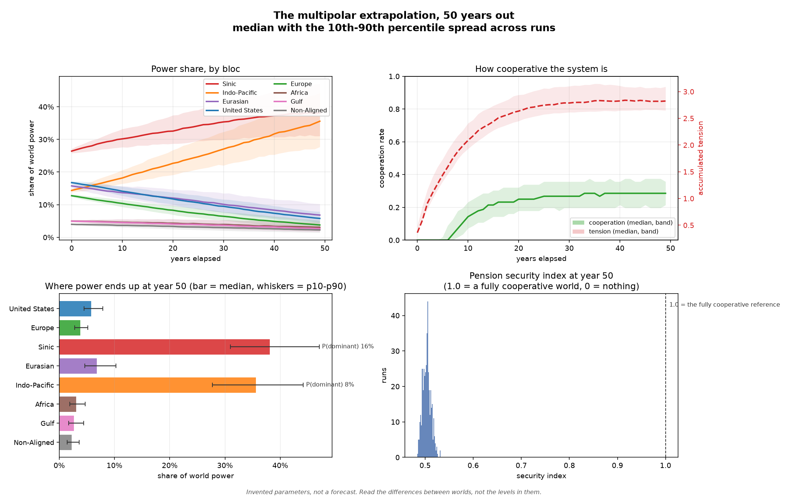
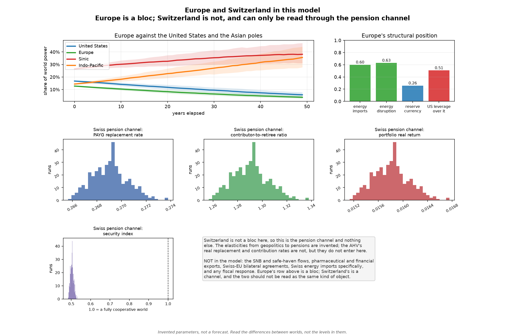
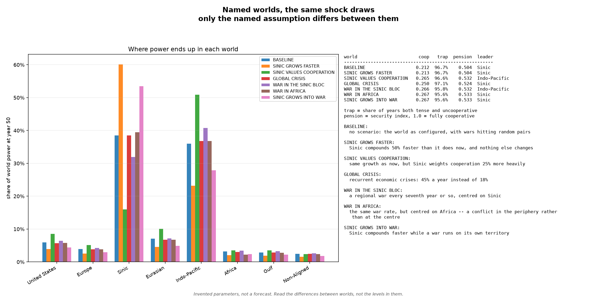

# multipolar_sim

A Monte Carlo simulator for a multipolar world: eight power blocs, every pair
playing a 2×2 Cooperate/Compete game each year with its Nash equilibrium solved
(pure or mixed), annual shocks, and a pension-security read-out.
Run it with `cargo run -p multipolar_sim`, and with `--sweep` for the run that
actually matters.

```
cargo run -p multipolar_sim -- --compare               # who wins, and who loses
cargo run -p multipolar_sim -- --ai                    # AI as a player, or as a tool?
cargo run -p multipolar_sim -- --sweep                  # the informative mode
cargo run -p multipolar_sim -- --seed 42 --runs 1000    # reproducible ensemble
cargo run -p multipolar_sim -- --export out/world        # CSV, then:
python tools/plot_multipolar.py out/world                # the pictures
cargo run -p multipolar_sim -- --bloc "United States:0.50:0.02:0.010:1.0"
cargo run -p multipolar_sim -- --bloc "Antarctic:0.06:0.010:0.020:1.00"
cargo run -p multipolar_sim -- --help
```

The pictures it draws are embedded under
[Plotting the extrapolation](#plotting-the-extrapolation) below — including what it says
about Europe and about the Swiss pension channel.

`--compare` answers "who wins and who loses" directly. It runs the same years
twice, from the same shock draws, once with a cooperative payoff balance and once
with a non-cooperative one, and prints each bloc's share and dominance probability
in both worlds next to how the world itself fares. It then separates the two claims
worth separating: a cooperative world is better on *every* aggregate while still
redistributing power away from some blocs, which is robust, whereas the *identity*
of the largest bloc is decided by the invented starting shares and growth biases and
should not be read as a prediction.

`--bloc` takes `Name:share:bias:volatility:affinity` with an optional sixth field,
the bloc's **cooperation valuation**. It edits the named bloc if the system has one
and appends it otherwise, and is repeatable — so the default system can be
reshaped a field at a time or replaced outright. The valuation is the field that
makes the two sides of a dyad differ, because it enters that bloc's own payoff
matrix; omitting it leaves the bloc neutral at `1.0`, which is what every bloc was
before the game became a bimatrix. `--seed` makes a whole ensemble reproducible,
which is what lets two parameter settings be compared against the same shock draws
instead of against different luck. `--help` prints every flag with its real default,
derived from the code rather than written out by hand.

## Plotting the extrapolation

`--export <dir>` writes the run out as CSV — per-year quantiles across runs for every
bloc's power share and for cooperation, tension and Pareto loss; one row per run for the
end states; the pension channel per run; and the exposure, monetary-leverage and
energy-flow tables. `tools/plot_multipolar.py <dir>` draws the figures from those files,
and takes an optional second directory to write them somewhere other than the data:

```
cargo run -p multipolar_sim --release -- --scenarios --runs 400 --seed 7 --export out/all
python tools/plot_multipolar.py out/all multipolar_sim/figures
```

`--scenarios --export <dir>` writes both the baseline world's bundle and the scenario
comparison into the one directory, so all three figures come from a single command and a
single plot invocation. The script skips a figure whose input files are absent rather than
failing, which is what makes that work.

The three images below are a **snapshot**, committed so this page renders on a machine
that has never run the simulator: 400 runs, seed 7, `--scenarios`. The CSVs they were
drawn from are git-ignored and regenerated by the two commands above. A snapshot can drift
from the code — if a figure and the prose disagree, the prose was measured more recently
than the picture, and the two commands settle it.

### The world, extrapolated



Fifty years, with the spread across runs rather than a single line: Sinic and Indo-Pacific
pull away from everyone, the European and American shares fall, and cooperation settles
near 0.21 while tension keeps climbing. The bottom-right panel is the pension channel — the
security index clusters around 0.5, against 1.0 for a fully cooperative world.

### Europe, and the Swiss pension channel



The top-left panel is the whole answer to "what happens to Europe": it tracks the two Asian
poles downwards together with the United States, and the figure cannot show that the
*level* it settles at is decided by whether the system is cooperative — for that, run
`--compare`, where Europe ends at 11.8% under cooperation and 3.7% without. The top-right
panel is what Europe is exposed to, and the bottom row is the only Swiss thing in this
crate. The caveat in the lower right is part of the figure because it is part of the claim.

### The named worlds



Every world of `--scenarios` from the same shock draws, so the differences between the bars
are the assumptions and not the luck. The table beside them is where the counterintuitive
result lives: a global crisis *raises* cooperation, because sustained tension is what erodes
the payoff of mutual competition.

Two things about the pictures are deliberate. The bands are quantiles **across runs at a
fixed year**, so they show the model's own dispersion and *not* uncertainty about the
world: the uncertainty that matters here is in the parameters, and the export holds those
fixed while the shocks vary — `--sweep` is the mode for the other question. And the figures
are drawn from CSV only: the script never runs the simulation and never invents a number,
so every value on a figure can be traced back to `config.txt` beside it.

## Splitting the Atlantic bloc, and what it says about Europe

`Atlantic` was one 0.30 bloc covering the United States *and* the euro area. The code said
so out loud — `economy.rs` noted that the two halves have "opposite" energy positions, and
`default_reserve_shares` handed the dollar and the euro to the same actor. That made the
transatlantic relationship, which is the relationship this model is best placed to say
something about, invisible by construction: one bloc issued both reserve currencies, so
`monetary_leverage` could never express the dollar's hold over the euro area.

They are now separate blocs, inheriting the aggregate's growth bias, volatility and
affinity so that the split changes the network rather than the guesses. What changes
structurally is the attribution: the euro's 20.25% of world reserves goes to Europe and the
dollar's 56.77% stays with the United States, the American energy position (imports 15%,
exports 20%) stops being averaged with the European one (imports 60%), and the 52.5% of EU
LNG imports that come from the United States becomes a flow the model can sever rather
than intra-bloc trade it could not see.

What it says, at 400 runs and seed 7:

* **Europe's fate is decided by whether the system is cooperative, far more than by
  anything else in the model.** In the `--compare` worlds Europe ends at **11.8%** of world
  power under a cooperative payoff balance and **3.7%** under a competitive one — from
  13.0% at the start, so a cooperative world costs it about a point and a competitive one
  costs it nine. In the mixed baseline it lands at 3.9% (`--scenarios`, `BASELINE`).
* **The asymmetry it faces is monetary.** The United States holds the dollar and therefore
  leverage 0.51 *over* Europe, against Europe's 0.00 over it, and Europe imports 60% of its
  energy against the United States' 15%. Both are reported in the export and drawn on
  `fig2`.
* **The bloc that benefits most from cooperation is not a great power.** In the
  cooperative world Africa goes 5.0% → 11.0% and the Gulf 5.0% → 12.9%, while the United
  States goes 17.0% → 8.7%. A cooperative world is one in which the periphery gains
  relative ground and the incumbent loses it, which is the opposite of the intuition that
  cooperation favours the strong.

**Switzerland is not a bloc and is not plotted as one.** It has no power share to
extrapolate, and the only Swiss thing in this crate is the pension channel in `pension.rs`.
So `fig2` shows the pension channel — replacement rate, contributor-to-retiree ratio,
portfolio return and the security index, one histogram per run — and states on its own face
what is missing: the SNB and safe-haven flows, pharmaceutical and financial exports,
Swiss-EU bilateral agreements, Swiss energy imports specifically, and any fiscal response.
The elasticities from geopolitics to pensions are invented; the AHV's real replacement and
contribution rates do not enter.

## The 2×2 is a bimatrix, and why that mattered

The solver takes **one payoff matrix per side** (`solve_bimatrix`, with `solve_pair`
taking the documented symmetric fast path when the two are equal). This is worth
explaining because the first version of this crate could not express a claim as basic
as *cooperation is worth more to this bloc than to that one* — which is not a detail,
since it is exactly the claim `MULTIPOLAR_GAME.md` §4 is organised around.

Two things follow from it, and both are load-bearing:

* **`cooperation_valuation` was added** to `PowerBloc`: what cooperation is worth
  *when choosing*, entering the payoff matrix. It is deliberately separate from
  `cooperation_affinity`, which is what cooperation *pays once chosen* — downstream of
  the solver, so it cannot change a decision. A test pins both halves: affinity cannot
  move the cooperation rate, valuation can.
* **A symmetric game is never answered asymmetrically.** In the region where the
  sucker's payoff beats mutual competition — which the simulation reaches at high
  tension — a symmetric game has three equilibria: `(C,D)`, `(D,C)` and a mixed one.
  The first two pay more in total, but selecting either would mean deciding which of two
  *identical* players is the exploiter, so the solver searches only `(C,C)` and `(D,D)`
  when the matrices are equal and falls back to the mixed equilibrium. Where the
  matrices differ, all four profiles are candidates and the tie between `(C,D)` and
  `(D,C)` is broken by a stated convention — the side that values cooperation more is
  the one that cooperates — so the answer does not depend on argument order. A test
  checks that invariance across a grid.

**The already-published figures did not move.** `--sweep` and `--compare` outputs are
byte-identical to before the change, because every default bloc is neutral on
valuation and the symmetric fast path therefore runs the original code. That is
verified by construction rather than by a test alone, and the baseline outputs were
diffed to confirm it.

One consequence worth knowing: behaviour is **discontinuous at perfect symmetry**. With
every valuation equal, the asymmetric branch is closed; any nonzero spread opens it. So
a model like this cannot be read as continuous in the spread of valuations, which the
`--ai` cooperation sweep says in its own output.

## AI in the game: player, or tool?

`MULTIPOLAR_GAME.md` §7 lists four live answers to "who captures the gains from
AI" and declines to pick one. `--ai` builds the two that are structurally
different, plus the control, and runs all three from the same shock draws:

| World                    | What it assumes                                                              | The question it poses                         |
| ------------------------ | ---------------------------------------------------------------------------- | --------------------------------------------- |
| `AI AS A SIXTH POWER`  | AI is a player: it holds power of its own and plays every dyad               | Does it end a hegemon, or is it held down?    |
| `AI AS A WIELDED TOOL` | AI is owned: no new player, but each bloc's power grows with its own AI lead | Does uneven ownership concentrate the system? |
| `NO AI LAYER`          | The existing model, unchanged                                                | The control both are measured against         |

They are not two answers to one question, so each is scored on its own terms
rather than on one shared metric. The layer is a *transformation of the bloc
list* — one world appends an actor, the other adds a term to `growth_bias` — which
keeps the Monte Carlo, the solver and the pension channel untouched, and makes the
control the existing model rather than a reimplementation of it that could drift.

What the default run says, and the honest limits of it:

* **As a player, AI gains ground — and that verdict is one of the things the regional
  split changed.** Grown at exactly the fastest-growing conventional bloc's rate, the
  actor ends at 10.7% of world power against the 4.8% it starts with. Before the
  corrections described under "The regional split" below it ended at 2.4%, and that
  verdict rested substantially on a defect rather than on the structure: the
  payoff-to-power transfer was an absolute increment, so it moved the system's
  *smallest* member — the AI actor — several times further, relatively, than anyone
  else. The structural asymmetry the old verdict was attributed to is real and is
  still printed (no reserve currency, maximum leverage held over it, 0.95 energy
  exposure); what changed is that it no longer outweighs a 5%-a-year growth advantage.
* **It becomes hegemon only on a large growth advantage, and the sweep names it.**
  The fate column turns from `ABSORBED` through `ASCENDANT` to `HEGEMON` between
  roughly 8% and 11% a year of compounded growth against a field whose weighted mean
  is about 2%. That is the number worth arguing about, not the share printed beside
  it. The headline figure is robust to the growth-bias correction described in
  limitation 3: the hinge sat at 8–11% a year *effective* before it, and at 8–11% a
  year nominal after, which is what the re-statement was for.
* **As a tool, uneven ownership concentrates the system a lot; equal ownership
  does nothing.** In the default run the two frontier leaders gain and all three
  laggards lose, and the control — the same lead for everyone — moves the top share
  by under half a point. A general-purpose capability that lifts every bloc equally
  is very nearly invisible in a model of *relative* power. The *sizes* do not order
  by lead, though, and the mode does not claim they do: the lead term sits on top of
  each bloc's pre-existing starting share and growth bias, so a bloc with a smaller
  lead can gain more than one with a larger lead.
* **Which bloc owns AI is not a prediction.** The lead vector's *shape* follows
  widely reported capability concentration; its magnitudes are invented, and the
  ranking it produces is a property of the parameterisation.

Three limitations the mode prints rather than hides:

1. **The cooperation channel now works, and it took the bimatrix to get there.** The
   third sweep row was flat at every value in the first version of this feature,
   because `--ai-cooperation` raised `cooperation_affinity` — a term applied
   *downstream* of the solver — and so could not change a decision. It now raises the
   owning bloc's `cooperation_valuation`, which enters the payoff matrix, and the row
   moves: `-0.15` leaves cooperation at `0.278` and `+0.15` at `0.338`, which is the
   realist case against the optimistic one, measured. That gap is narrower than it was
   before the regional split — `0.334` against `0.422` — because the asymmetric branch
   now fires less often at extreme valuations, but the sign and the ordering are
   unchanged. The default row is a knife-edge (see above), and the sweep says so.
2. **Adding any sixth actor changes the field, not only an AI one.** One more member
   means one more dyad for every existing bloc, and a dyad carries tension, energy
   interdependence and sanction drag. What it no longer changes is anybody's growth
   rate or the tension index — see the next item. The verdict is unaffected — it is
   measured on the actor itself — but a per-bloc comparison against the control is not
   a clean isolation and is not presented as one.
3. **Growth biases are annual rates, tension is a system-level index, and the
   payoff-to-power transfer is proportional — all three took a correction.** The
   regional split exposed three places where the model was implicitly calibrated to a
   world of five similarly-sized blocs: growth compounded once per pair, tension fed
   once per pair, and a payoff transfer that moved every bloc by the same *absolute*
   amount. Each is described, with what it did to the published figures, under "The
   regional split" below. The summary: the aggregates barely moved (cooperation
   `0.216` → `0.215`, tension `2.86` → `2.86`, trap years `94.8%` → `94.9%`) and the
   hierarchy flattened (Sinic `43.8%` → `39.7%`, Non-Aligned `6.3%` → `8.7%`), which
   is exactly what removing a regressive transfer should do. One AI verdict changed
   with it, and the note on that bullet above says why.

## The regional split, and the three places the model was calibrated to five blocs

`Non-Aligned` used to be a single 0.14 residual: the Gulf exporters, most of Africa,
Latin America, and the parts of Asia that align with no pole. It is now `Africa` (0.05),
`Gulf` (0.05) and a residual `Non-Aligned` (0.04), which gives two things the residual
could not. `--war-target Africa` now has a referent, and the one energy anchor the model
actually carries for the region — Algeria at 27.4% of EU pipeline gas — stops being
attributed to a bloc whose own description never named Africa. The three inherit the
aggregate's parameters rather than being given a spread of their own, so the split
changes the *network* and not the guesses; the doc comment on `default_blocs()` says why.

Splitting one bloc into three is a change of *granularity*, not of substance, and that
is what made it useful: three quantities turned out to be calibrated to a five-bloc
world, and not one of them was visible while the bloc list never changed size.

1. **Growth compounded once per pair.** `simulation.rs` added `power * growth_bias`
   inside the dyad loop as well as in the annual drift step, so an `n`-bloc world
   compounded every bias `n` times a year and a nominal `0.008` was really about 4.1% a
   year. Growth is now applied once, in the drift step, and the defaults are stated as
   annual rates on the old convention's conversion (`(1 + b)^5 - 1`). The invariant is
   pinned by a test that measures the dynamics: the same bias must buy the same annual
   growth in a seven-bloc world as in a five-bloc one.
2. **Tension was fed once per pair.** `tension_per_conflict` was added for every
   competing dyad, and tension is a *system-level* index — the report calls it the mean
   accumulated tension. Seven blocs have 21 pairs against five blocs' 10, so the same
   behaviour would have run at roughly twice the tension, and everything downstream of
   tension (cooperation, trap years, the pension index) with it. The feed is now scaled
   by the pair count against the ten-pair reference, which is exactly `1.0` at the
   reference size and leaves the five-bloc figures untouched.
3. **The payoff-to-power transfer was an absolute increment.** A banked payoff moved
   every bloc by the same absolute amount, so it moved a bloc of 4% six times as far,
   relatively, as one of 26%. That is a transfer from small blocs to large ones for
   identical behaviour — mild at the old sizes, where the range was 14% to 30%, and
   dominant once a 4% region existed: it drained Africa to **0.1%** of world power
   within fifty years. The transfer is now proportional to the bloc's own power, with
   the coefficient stated per unit of system mean power so that the average bloc behaves
   as it did.

What the corrections did to the published figures, since none of them was free. At the
five-bloc reference size the *aggregates* are as they were — cooperation `0.216` →
`0.215`, tension `2.86` → `2.86`, conflict-trap years `94.8%` → `94.9%`, Pareto loss
`0.453` → `0.454`, pension index `0.506` → `0.505` — while the *hierarchy* flattens:
Sinic `43.8%` → `39.7%`, Indo-Pacific `38.3%` → `36.6%`, Atlantic `7.3%` → `8.6%`,
Eurasian `4.3%` → `6.4%`, Non-Aligned `6.3%` → `8.7%`. One published verdict moved and
is worth naming: **AI as a player is now `ASCENDANT` (`4.8%` → `10.7%`) rather than
`ABSORBED` (`4.8%` → `2.4%`)**, because the AI actor is the smallest member of the
system and defect 3 was doing much of the work that the report attributed to its lack of
monetary sovereignty.

At the eight-bloc default the game is close to where it was and the hierarchy is not:
baseline cooperation `0.212`, tension `2.86`, trap years `96.7%`, with Sinic at `38.5%`
and Indo-Pacific at `36.0%` against the United States `6.0%`, Europe `3.9%`, Africa
`3.2%`, Gulf `2.9%` and Non-Aligned `2.4%`. The peripheral blocs lose ground in the
baseline and *gain* it heavily in a cooperative world (Africa `5.0%` → `11.0%`, Gulf
`5.0%` → `12.9%`), which is the `--compare` reading worth carrying away: who the game
rewards depends on whether cooperation pays, and in this parameterisation it rewards the
periphery. Europe is the clearest case of the *opposite* sensitivity: it goes `13.0%` →
`11.8%` in the cooperative world and `13.0%` → `3.7%` in the competitive one, so the same
question costs it one point or nine.

One consequence the split made visible and did *not* fix: the sanction drag is applied
per adversarial dyad, so a bloc with more adversaries absorbs more of it. That is
defensible — more adversaries, more sanctions — but it is a second way in which the
number of blocs moves a bloc's trajectory, and it is stated rather than left to be
discovered.

## Read this before using any number it prints

**Nothing in this crate is calibrated.** The growth rates, volatilities,
cooperation gains, conflict costs and pension elasticities are chosen to be
plausible in sign and rough magnitude so the *mechanism* can be explored. They are
not measurements, and no output here is a forecast.

The reason is the one `MULTIPOLAR_GAME.md` section 5 states and `FutureWork.md`
section 7 warns about: there is no general theorem guaranteeing that a multipolar
system converges at all, and a simulator that produced confident-looking 50-year
numbers from unfitted parameters would be exactly the "plausible narrative wrapped
around unfitted parameters" that section 7 rejects.

So the honest use of this tool is **sensitivity**, not prediction:

* A quantity that barely moves across a parameter's plausible range is one the
  conclusion does not depend on, and is safe to be wrong about.
* A quantity that flips across that range is one the conclusion *is* conditional
  on, and any claim resting on it has to say so.

`--sweep` prints exactly that comparison, and the binary prints the caveat before
any result rather than after it.

## Why this is a separate crate

This crate is a workspace member of `life_optimizer`, not a module of it, and the
boundary is deliberate.

`life-optimizer`'s figures are either traced to an official source or explicitly
flagged as unsourced — see the `Provenance` enum in `src/cantons.rs` and section 7
of `FutureWork.md`. It has no fallback path by construction. This crate's figures
are illustrative by construction. Those are opposite epistemic standards, and each
is right for its own subject.

Keeping them in separate crates means an illustrative number cannot reach a
reported tax or pension figure by accident: the boundary is a `use` statement that
does not exist. If the two are ever connected, the connection should be an
explicit, opt-in interface — a scenario the simulator *emits* and the tax tool
*reads*, with the borrowed figures labelled as illustrative in the output — rather
than shared code.

A build failure in this crate must also never be able to block `life-optimizer`.

## Where this sits in the wider project

The model is the formal counterpart of three documents that already live in the
repository root:

| Document                                       | What it claims                                                                                                        | What this crate does with it                                                                                        |
| ---------------------------------------------- | --------------------------------------------------------------------------------------------------------------------- | ------------------------------------------------------------------------------------------------------------------- |
| `MULTIPOLAR_GAME.md` §4                     | The security dilemma is the characteristic risk of a multipolar transition                                            | `blocks.rs` builds the payoff matrix that produces it, and `game.rs` solves it rather than assuming the outcome |
| `MULTIPOLAR_GAME.md` §8                     | Imperial overstretch: an arms race eventually stops paying for itself                                                 | `GameParams::conflict_wear` — the only channel by which conflict becomes self-limiting                           |
| `THEORY_OF_SPARING.md` §7d                  | Engineered obsolescence as a 2×2 game with a Pareto-inferior Nash equilibrium                                        | The same solver;`efficiency_loss` is the operational measure of that inferiority                                  |
| `PHILOSOPHICAL_SOCIOLOGICAL_ASPECTS.MD` §2c | AHV is a pay-as-you-go intergenerational contract, and "optimal for the individual is not optimal for the collective" | `pension.rs` — the voice the household tool has no way to represent                                              |

## Layout

| Module            | Responsibility                                                                  |
| ----------------- | ------------------------------------------------------------------------------- |
| `game.rs`       | 2×2 bimatrix game, Nash equilibrium selection (pure or mixed), efficiency loss |
| `blocks.rs`     | Power blocs and the payoff structure their interactions produce                 |
| `economy.rs`    | Monetary standing, energy trade, financial conditions — with provenance        |
| `ai.rs`         | AI as a player and AI as a tool: the two rival hypotheses, and the verdicts     |
| `simulation.rs` | The Monte Carlo: one run, and the ensemble over many                            |
| `pension.rs`    | The AHV/pension channels the simulated world implies                            |
| `report.rs`     | Terminal presentation                                                           |
| `export.rs`     | CSV for plotting: per-year quantiles, per-run end states, exposure and leverage |
| `main.rs`       | CLI, argument parsing,`--sweep`, `--compare`, `--ai`                      |

## The economic layer, and what is measured versus invented

`economy.rs` supplies the economics that decides what the strategic structure
*costs*: who issues the money others hold, who depends on whose energy, and how
strained the financial system is.

Every quantity carries a `Provenance`, either `Sourced { source, vintage }` or
`Illustrative { rationale }`, and the report prints the table so a reader can see
which is which without reading the prose. The split is:

* **Sourced**: reserve-currency composition (IMF COFER, 2025 Q4 — USD 56.77%, EUR
  20.25%, CNY 1.95%, 6.13% in currencies COFER does not identify, a category that
  has more than doubled since 2021); the direction and aggregate size of energy
  flows (about 80% of Russian oil exports went to China and India in 2025; Russian
  gas was 16.1% of EU LNG and 16.3% of EU pipeline-gas imports, against a US share
  of 52.5% of LNG).
* **Illustrative**: *every* transmission elasticity, without exception. Nobody can
  measure how a one-point shift in reserve share changes sanction leverage, because
  the counterfactual does not exist. Also illustrative: the split of a published
  aggregate across this model's blocs, because the blocs are political groupings
  that no statistical agency reports as a unit.

That second category is the honest part. A test enforces that no parameter ships
without a provenance that actually says something, and that every `Sourced` entry
names both a source and a vintage.

### Two doors into the model

Bloc-specific economics are partly about what a bloc **decides** and partly about what
it **pays**, and the layer enters through a different door for each:

* **Into the game**: the pair's interdependence raises what mutual cooperation is
  worth. Both sides feel it, so it belongs in both matrices. Alongside it sits each
  bloc's own cooperation valuation, which is what makes the two matrices differ. The
  interdependence term deliberately does *not* touch the temptation to defect: a richer
  relationship is worth more to capture as well as more to sustain, and picking a sign
  for that would be hiding a judgement.
* **Into the simulation**: energy disruption and monetary leverage hit individual
  blocs differently, so they act on that bloc's own power — the importer loses supply,
  the exporter loses revenue, and the bloc with less monetary leverage absorbs more of
  an adversarial turn.

The distinction matters for what each door can express. Capability asymmetries act on
power, so they belong downstream of the solver; value asymmetries act on the choice, so
they belong in the matrix. A test asserts that interdependence stays pair-symmetric,
because it describes the relationship rather than either side of it.

### Outstanding

Two items, both about how the *number of blocs* reaches the answer rather than about the
blocs themselves. The first two of the three granularity defects found by the regional
split are fixed and described above — a per-pair growth bias, a per-pair feed into a
system-level tension index, and an absolute payoff-to-power transfer. The third is
milder and is left in place, stated rather than hidden: the sanction drag is applied per
adversarial dyad, so a bloc with more adversaries absorbs more of it. That is defensible
as a mechanism, but it is one more place where changing the bloc list changes a bloc's
trajectory, and it is the item to look at first if a future comparison across
granularities comes out surprising.

The AI report used to print an *effective* annual growth beside the nominal one, because
the growth defect made the two differ; that column is gone, because they are the same
number.

The reserve shares are a fixed endowment held constant for all 50 years, so
de-dollarisation remains a change in the *level* of leverage rather than a drift in
it. De-dollarisation also cannot yet enter as a bloc-specific payoff: it is an
asymmetry in *capability*, which the bimatrix deliberately does not carry — the
matrices hold what a bloc values, not what it can do. A test asserts that
interdependence stays pair-symmetric for the same reason.

Not yet built: European deindustrialisation, and the crypto channel. That last one
is planned as a *falsifiable* test rather than an assumed buffer, because the
observed record runs the other way: in the March 2020 panic bitcoin fell about 56%,
worse than the S&P 500, and its correlation to equities **rose above 0.5 during
turbulence** while decaying toward zero in calm markets — the correlation
strengthens exactly when a buffer would be needed. (Sources: IMF COFER for
reserves; Deputy PM Novak via OilPrice and Eurostat via TASS for energy; The Block
via ForkLog for the crypto record.)
